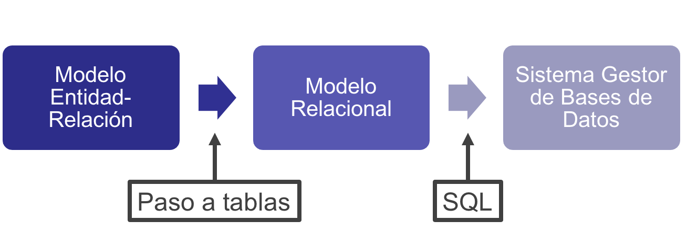
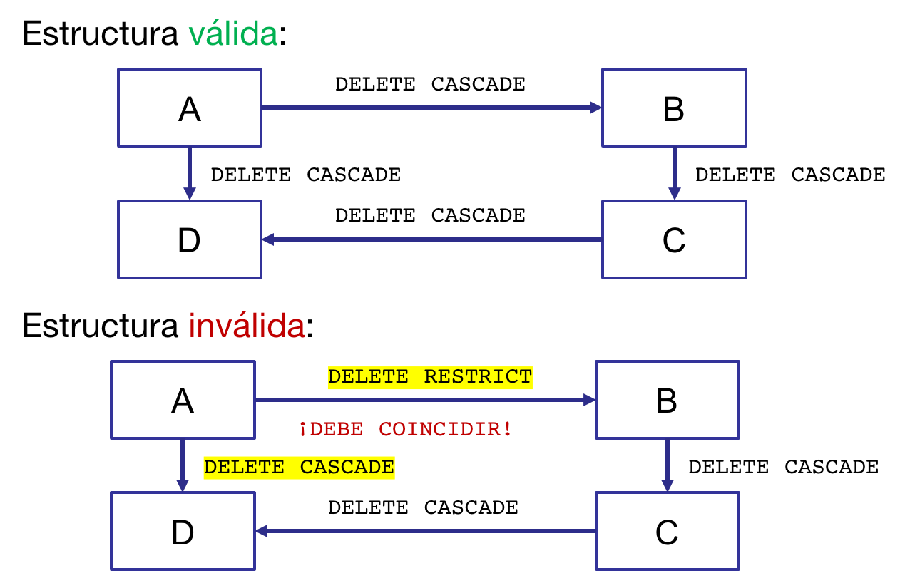

<!--
_header: ''
_footer:  Esta obra está bajo una [licencia de Creative Commons Reconocimiento-NoComercial-CompartirIgual 4.0 Internacional](http://creativecommons.org/licenses/by-nc-sa/4.0/). Icono diseñado por Flaticon
-->
<style>
img[alt~="center"] {
  display: block;
  margin: 0 auto;
}
img {
  background-color: transparent!important;
}
li {
  text-align: justify;
}
s {
  background-color: yellow;
  text-decoration: none;
}
p {
  text-align: justify;
}
/*Tablas centradas*/
table {
  width: auto;
  margin-left: auto;
  margin-right: auto
}
</style>

# TEMA 4

# El lenguaje SQL


---

## Índice

1. Introducción
2. Lenguaje de definición de datos
3. Integridad referencial
4. Consultas
5. Actualización y borrado de datos

---

# INTRODUCCIÓN

## El lenguaje SQL

---

## ¿Por qué necesitamos SQL?



---

## SQL: Structured Query Language

- Lenguaje de consulta estructurado para bases de datos relacionales.
- Es mucho más que un lenguaje de consulta, puesto que permite además funciones de definición y control de datos.
- La estandarización ha sido crucial para su difusión.
- Prácticamente la mayoría de los sistemas relacionales soportan las bases de SQL estándar y suelen incluir aportaciones propias.
- Utilizado masivamente en la industria.

---
<style scoped>
  td {font-size: 0.65rem}
  thead {font-size: 0.7rem}
</style>

## Evolución de SQL

| Año  | Nombre   | Comentarios                                           |
|------|----------|-------------------------------------------------------|
| 1986 | SQL-86   | Primera versión hecha por ANSI                        |
| 1989 | SQL-89   | Revisión menor                                        |
| 1992 | SQL-92   | Revisión mayor                                        |
| 1999 | SQL:1999 | Expresiones regulares, consultas recursivas, triggers |
| 2003 | SQL:2003 | XML básico, sequence, autoincrment                    |
| 2005 | SQL:2005 | XML avanzado                                          |
| 2008 | SQL:2008 | `ORDER BY`, `TRUNCATE`                                |
| 2011 | SQL:2011 | Datos temporales, `FETCH`                             |
| 2016 | SQL:2016 | Patrones y JSON                                       |

Fuente: [Wikipedia](https://es.wikipedia.org/wiki/SQL#Orígenes_y_evolución)

---

## Soporte CRUD

- ~~C~~reate:
  - Creación de tablas (`CREATE TABLE`)
  - Inserción de datos (`INSERT INTO`)
- ~~R~~ead:
  - Lectura de datos (`SELECT`)
- ~~U~~pdate:
  - Actualización de tablas (`ALTER TABLE`)
  - Actualización de datos (`UPDATE`)
- ~~D~~elete:
  - Borrado de tablas (`DROP`)
  - Borrado de datos (`TRUNCATE` y `DELETE`)

---

## Características de SQL

- Lenguaje de **definición** de datos (*DDL*):
  - Permite diseñar, definir, modificar y borrar las estructuras de almacenamiento de datos.
- Lenguaje de **manipulación** de datos (*DML*):
  - Permite insertar, recuperar, manipular, modificar y borrar datos.
- Lenguaje de **control** de datos (*DCL*):
  - Permite controlar y gestionar los permisos de la base de datos.

---
<style scoped>
li {
  font-size: 0.9rem;
}
</style>

## Sentencias SQL (I)

- Las sentencias SQL están formadas por:
  - Palabras reservadas.
  - Palabras definidas por el usuario (nombres de tablas, atributos, etc).
- Características de las sentencias:
  - _Case insensitive_: es indiferente escribir las palabras en mayúsculas o minúsculas.
  - Cada cláusula o palabra puede aparecer en líneas diferentes.
  - Se puede utilizar la indentación que se quiera.
  - Una sentencia o comando SQL finaliza con la aparición del símbolo `;`, aunque es opcional si el comando es único.

---
<style scoped>
li {
  font-size: 1rem;
}
</style>

## Sentencias SQL (II)

Explicaremos las sentencias SQL mediante notación BNF:

- Palabras en mayúsculas representan palabras reservadas.
- Palabras en minúsculas representan palabras definidas por el usuario.
- El símbolo `|` indica una elección entre alternativas.
- Las llaves `{}` representan elementos requeridos.
- Los corchetes `[]` representan elementos opcionales.
- Los `...` indican repetición opcional (0 ó más).

---

# LENGUAJE DE DEFINICIÓN DE DATOS

## El lenguaje SQL

---

## Schemas

En *MySQL* un schema en una agrupación de lógica de tablas que constituyen un modelo datos:


---

## Schemas

Sintaxis:

```bnf
CREATE {DATABASE | SCHEMA} [IF NOT EXISTS] nombre_del_schema
 [ [DEFAULT] CHARACTER SET [=] charset_name
 | [DEFAULT] COLLATE [=] collation_name
 | DEFAULT ENCRYPTION [=] {'Y' | ‘N’}];

```

Ejemplo de uso:

```SQL
CREATE SCHEMA etsisi
  DEFAULT CHARACTER SET utf8
  COLLATE utf8_spanish2_ci;
```

Más información sobre `COLLATE`: [documentación](https://dev.mysql.com/doc/refman/8.0/en/charset.html)

---

## Creación de tablas

```SQL
CREATE TABLE [schema.]nombre_tabla (
  atributo_1 tipo_1 [UNIQUE] [NOT NULL],
  atributo_2 tipo_2 [UNIQUE] [NOT NULL],
  …
  atributo_n tipo_n [UNIQUE] [NOT NULL]
);
```

Modificadores de columna:

- `UNIQUE`: No se permiten valores duplicados.
- `NOT NULL`: No se permiten valores nulos.

---

## Tipos de datos en SQL

| Familia    | Tipos                      |
|------------|----------------------------|
| Numericos  | `INTEGER`, `DECIMAL`       |
| Texto      | `VARCHAR(size)`, `TEXT`    |
| Enumerados | `ENUM('val1', ..., 'valn')`|
| Fecha      | `DATETIME`, `TIMESTAMP`    |

Más tipos de datos: [documentación](https://dev.mysql.com/doc/refman/8.0/en/data-types.html)

---
<style scoped>
  td {font-size: 0.8rem}
  thead {font-size: 0.8rem}
  s {text-decoration: underline; background-color: transparent}
</style>

# Creación de tablas: Ejemplo

| ~~ID~~ | NOMBRE | APELLIDOS    | DNI        | FECHA DE NACIMIENTO |
|--------|--------|--------------|------------|---------------------|
| 3      | Juan   | Gómez Pérez  | 00000000-T | 3 de mayo de 1983   |
| 67     | Lucía  | Álvarez León | 99999999-R | 7 de julio de 1995  |

```SQL
CREATE TABLE corporacion.personas (
  id        INTEGER     UNIQUE NOT NULL,
  nombre    VARCHAR(30) NOT NULL,
  apellidos VARCHAR(30) NOT NULL,
  dni       VARCHAR(10) UNIQUE NOT NULL,
  fecha_nac DATETIME
);
```

---

## Claves primarias

- Toda definición de una tabla debe indicar una clave primaria.
- Esta debe referenciarse a un atributo (o conjunto de atributos) que identifiquen unívocamente cada fila.
- El/los atributo/s deben declararse de la forma habitual.

```SQL
CREATE TABLE [schema.]nombre_tabla (
  ...
  PRIMARY KEY (atributo_1[, …, atributo_n])
);
```

---
<style scoped>
  td {font-size: 0.8rem}
  thead {font-size: 0.8rem}
  s {text-decoration: underline; background-color: transparent}
</style>

## Claves primarias: Ejemplo

| ~~ID~~ | NOMBRE | APELLIDOS    | DNI        | FECHA DE NACIMIENTO |
|--------|--------|--------------|------------|---------------------|
| 3      | Juan   | Gómez Pérez  | 00000000-T | 3 de mayo de 1983   |
| 67     | Lucía  | Álvarez León | 99999999-R | 7 de julio de 1995  |

```SQL
CREATE TABLE corporacion.personas (
  id        INTEGER     UNIQUE NOT NULL,
  nombre    VARCHAR(30) NOT NULL,
  apellidos VARCHAR(30) NOT NULL,
  dni       VARCHAR(10) UNIQUE NOT NULL,
  fecha_nac DATETIME
  PRIMARY KEY (id)
);
```

---

## Modificación de tablas

Añadir un nuevo atributo:

```SQL
ALTER TABLE [schema.]nombre_tabla
ADD definición_de_atributo;
```

Modificar un atributo:

```SQL
ALTER TABLE [schema.]nombre_tabla
MODIFY definición_de_atributo;
```

Eliminar un atributo:

```SQL
ALTER TABLE [schema.]nombre_tabla
DROP nombre_de_atributo;
```

---

## Eliminación de tablas

Vaciar una tabla (eliminar todas sus filas pero mantener la estructura):

```SQL
TRUNCATE TABLE [schema.]nombre_tabla;
```

Eliminar una tabla (todas sus filas **y también la estructura**):

```SQL
DROP TABLE [schema.]nombre_tabla;
```

---

## Inserción de datos

- Los datos deben añadirse fila a fila.
- Los datos añadidos deben cumplir las restricciones de la tabla:
  - La clave debe ser única.
  - No existirán valores nulos si se ha definido el atributo como `NOT NULL`.
  - Los tipos de datos deben coincidir.
  - No se admiten repeticiones si se ha definido el atributo como `UNIQUE`.

---

## Inserción de datos

Inserción de una fila de datos:

```SQL
INSERT INTO [schema.]tabla (atributo_1, …, atributo_n) 
  VALUES (valor 1, …, valor_n);
```

La lista de atributos es opcional. En ese caso, se asume el orden definido en el `CREATE TABLE`:

```SQL
INSERT INTO [schema.]tabla 
  VALUES (valor 1, …, valor_n);
```

**Solo podrán omitirse columnas que no hayan sido definidas como** `NOT NULL`.

---
<style scoped>
  td {font-size: 0.8rem}
  thead {font-size: 0.8rem}
  s {text-decoration: underline; background-color: transparent}
</style>

## Inserción de datos: ejemplos

`PERSONAS`:

| ~~ID~~ | NOMBRE        | DNI        | FECHA_NAC              |
|--------|---------------|------------|------------------------|
| 3      | Juan Gómez    | 00000000-T | 3 de mayo de 1983      |
| 67     | Lucía Duque   | 99999999-R | 7 de julio de 1995     |
| 101    | Diana Álvarez | 12345678-Z | 9 de diciembre de 2000 |

```SQL
INSERT INTO corporacion.personas (id, nombre, dni, fecha_nac)
  VALUES (3, “Juan Gómez”, “00000000-T”, “1983-05-03”);

INSERT INTO corporacion.personas
  VALUES (67, “Lucía Duque”, “99999999-R”, “1995-07-07”);

INSERT INTO corporacion.personas (nombre, fecha_nac, dni, id)
  VALUES (“Diana Álvarez”, “2000-12-09”, “12345678-Z”, 101);
```

---
<style scoped>
  td {font-size: 0.8rem}
  thead {font-size: 0.8rem}
  s {text-decoration: underline; background-color: transparent}
</style>

## Inserción de datos: ejemplos

Es posible insertar varias filas con una única sentencia `INSERT INTO`.

| ~~ID~~ | NOMBRE        | DNI        | FECHA_NAC              |
|--------|---------------|------------|------------------------|
| 3      | Juan Gómez    | 00000000-T | 3 de mayo de 1983      |
| 67     | Lucía Duque   | 99999999-R | 7 de julio de 1995     |
| 101    | Diana Álvarez | 12345678-Z | 9 de diciembre de 2000 |

```SQL
INSERT INTO corporacion.personas VALUES
  (3,   “Juan Gómez”,    “00000000-T”, “1983-05-03”),
  (67,  “Lucía Duque”,   “99999999-R”, “1995-07-07”),
  (101, “Diana Álvarez”, “12345678-Z”, “2000-12-09”);
```

---

## Valores por defecto

- Es posible definir valores por defecto a los atributos.
- Se definen en la sentencia CREATE TABLE:

```SQL
CREATE TABLE [schema.]tabla (
  …
  atributo tipo [UNIQUE] [NOT NULL] [DEFAULT valor],
  …
);
```

- Si no se especifica el valor al realizar el `INSERT INTO`, se pone el valor por defecto.

---
<style scoped>
li {
  font-size: 0.8rem;
}
</style>

## Generación automática de claves

- Es posible generar claves únicas de forma automática.
- Se debe definir un atributo numérico como `AUTO_INCREMENT`.
- El atributo tomará un valor incremental cada vez que se inserte una nueva fila.
  - No debe especificarse su valor cuando se realiza el `INSERT INTO`.

```SQL
CREATE TABLE corporacion.dersonas (
  id        INTEGER UNIQUE NOT NULL AUTO_INCREMENT,
  nombre    VARCHAR(30) NOT NULL,
  apellidos VARCHAR(30) NOT NULL,
  fecha_nac DATETIME,
  PRIMARY KEY (id)
);

INSERT INTO corporacion.personas (nombre, apellidos, fecha_nac)
  VALUES (“Juan”, “Gómez”, “1983-05-03”);
```

---

# INTEGRIDAD REFERENCIAL

## El lenguaje SQL

---

## ¿Qué es la integridad referencial?

- Implantación de restricciones referenciales de acuerdo con un conjunto predefinido de reglas de `INSERT`, `UPDATE` Y `DELETE` que gobiernan las operaciones de inserción, borrado, actualización y carga sobre tablas relacionadas mediante claves primarias y claves ajenas.
- La integridad referencial se encarga de conservar y garantizar automáticamente la integridad de todos los datos almacenados.

---
<style scoped>
  td {font-size: 0.6rem}
  thead {font-size: 0.7rem}
  p {font-size: 0.7rem}
  s {text-decoration: underline; background-color: transparent}
</style>

## Integridad referencial: ejemplo

Supongamos que tenemos las siguientes tablas:

`EMPLEADOS`

| ~~ID_E~~ | NOMBRE   | APELLIDOS    | ID_D |
|----------|----------|--------------|------|
| 11       | Fernando | Ruíz Pérez   | 2    |
| 67       | Raúl     | Gómez García | 4    |

`DEPARTAMENTOS`

| ~~ID_D~~ | NOMBRE               |
|----------|----------------------|
| 2        | I+D+i                |
| 4        | Dirección y gobierno |

¿Puedo borrar el departamento 2 sin que afecte a Fernando?
¿Puedo actualizar el departamento 4 sin que afecte a Raúl?

---

## Restricción referencial

- Para mantener la **Integridad Referencial** debemos añadir **Restricciones Referenciales** cuando definimos las tablas.
- Una Restricción Referencial permite “vincular” la clave foránea de una tabla con la clave primaria de otra tabla (o la misma).
- Se deben definir las opciones de integridad referencial:
  - Política de actualización.
  - Política de borrado.

---

## Restricción referencial en SQL


---
<style scoped>
li {
  font-size: 0.85rem;
}
</style>

## Reglas de integridad referencial

- `ON DELETE` permite definir qué sucede con la clave foránea cuando se elimina la clave primaria.
- `ON UPDATE` permite definir qué sucede con la clave foránea cuando se actualiza la clave primaria.
- Cuatro opciones:
  - `RESTRICT` (o `NO ACTION`): impide la propagación de la operación. **Opción por defecto**.
  - `SET NULL`: se pone a `NULL` la clave ajena, siempre que sea posible.
  - `CASCADE`: se propaga la operación.
  - `SET DEFAULT`: se pone al valor por defecto la clave ajena, si es posible.

---

## Restricción referencial: ejemplo

```SQL
CREATE TABLE corp.departamentos (
  id_d      INTEGER     UNIQUE NOT NULL AUTO_INCREMENT,
  nombre    VARCHAR(60) NOT NULL,
  PRIMARY KEY (id)
);

CREATE TABLE Corp.empleados (
  id_e       INTEGER     UNIQUE NOT NULL AUTO_INCREMENT,
  nombre     VARCHAR(60) NOT NULL,
  apellidos  VARCHAR(60) NOT NULL,
  id_d       INTEGER     NOT NULL,
  PRIMARY KEY (id),
  CONSTRAINT
    FOREIGN KEY (id_d)
    REFERENCES copr.departamentos (id_d)
    ON DELETE NO ACTION
    ON UPDATE CASCADE
);

```

---

## Estructura referencial

- Definiremos una estructura referencial como el conjunto de tablas y restricciones entre ellas de modo que cada tabla del conjunto es padre o dependiente de otra u otras del mismo conjunto.
  - Gráficamente se indica una flecha desde la clave foránea a la clave primaria.
- Existen tres tipos de estructuras:
  - Lineal.
  - Cíclica.
  - Cíclica-autoreferencial.

---

## Estructura lineal


---

## Estructura lineal



---

## Estructura cíclica


---

## Estructura cíclica


Eliminamos de T1 la fila con clave T1A. ¿Qué sucede?

---

## Estructura cíclica


Eliminamos de T1 la fila con clave T1A. ¿Qué sucede?

---

## Estructura cíclica autoreferencial


